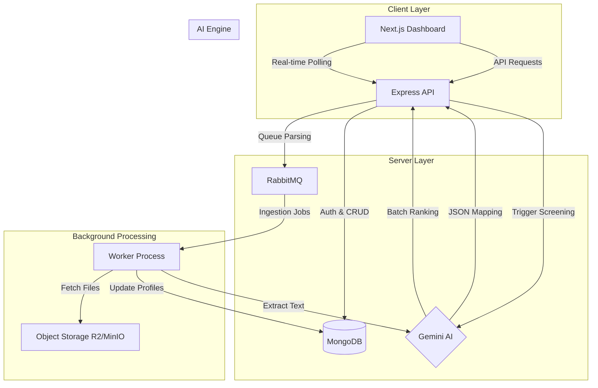

# CogniCV — AI-Powered Talent Screening Platform

CogniCV is an intelligent recruitment tool designed to automate and enhance the candidate screening process. Built for high-volume recruitment, it leverages Google's Gemini AI to parse resumes, analyze candidate fit against job descriptions, and provide explainable ranking shortlists.

## Project Overview

CogniCV solves the challenge of manual resume screening by providing:
- **AI-Powered Resume Parsing**: Automatically extracts structured data (skills, experience, education) from PDF resumes.
- **Intelligent Job Creation**: An AI chat assistant that helps recruiters generate detailed, markdown-formatted job descriptions.
- **Weighted Scoring Engine**: Ranks candidates based on a multi-dimensional scoring model (Skills, Experience, Education, Relevance).
- **Explainable AI**: Provides specific "Strengths", "Gaps", and "Recommendations" for every candidate.
- **Real-time Progress Tracking**: Visual feedback during the AI screening process.
- **Secure Sharing**: Generate password-protected links to share candidate analysis with stakeholders.

### Tech Stack
- **Frontend**: Next.js 15+, Tailwind CSS, Shadcn/UI, TanStack Query.
- **Backend**: Node.js, Express, TypeScript.
- **Database**: MongoDB (Mongoose).
- **Messaging/Queue**: RabbitMQ.
- **Storage**: Cloudflare R2 / MinIO (S3 Compatible).
- **AI Engine**: Google Gemini 2.5 Flash & Google Gemini 2.5 Flash.

## 🏗 System Architecture



1.  **Client (Next.js)**: Handles the dashboard, job management, and real-time visualization of screening results.
2.  **Server (Express)**: Orchestrates API requests, manages the database, and interacts with Gemini.
3.  **RabbitMQ**: Manages asynchronous tasks like heavy resume parsing and ingestion.
4.  **Worker**: Consumes messages from RabbitMQ to process resumes in the background.
5.  **Gemini API**: Acts as the "Brain" for both resume parsing and candidate evaluation.
6.  **Object Storage**: Stores uploaded resume files securely.

## Setup Instructions

### Prerequisites
- **Node.js** (v18+)
- **pnpm** (recommended) or npm/yarn
- **Docker** and **Docker Compose**
- **Google Gemini API Key**

### 1. Clone and Install
```bash
# Clone the repository
git clone <repo-url>
cd cognicv

# Install dependencies for both client and server
cd client && pnpm install
cd ../server && pnpm install
```

### 2. Infrastructure (Docker)
Run the required infrastructure services (RabbitMQ and MinIO):
```bash
docker-compose up -d
```
*This will start RabbitMQ on port 5672/15672 and MinIO on port 9000/9001.*

### 3. Environment Variables
You need to set up `.env` files in both the `client` and `server` directories.

#### **Server (`server/.env`)**
Copy `server/.env.example` to `server/.env` and fill in the values:
- `MONGO_URI`: Your MongoDB connection string.
- `GEMINI_API_KEY`: Your Google AI Studio API Key.
- `RABBITMQ_URL`: `amqp://localhost` (if using Docker).
- `R2_ACCESS_KEY_ID`, `R2_SECRET_ACCESS_KEY`: For storage (or local MinIO credentials).

#### **Client (`client/.env`)**
Copy `client/.env.example` to `client/.env`:
- `NEXT_PUBLIC_SERVER_URL`: `http://localhost:8001` (default backend port).

### 4. Running the Application
**Start the Backend:**
```bash
cd server
pnpm dev
```

**Start the Frontend:**
```bash
cd client
pnpm dev
```

The application will be available at `http://localhost:3000`.

## Environment Variables Detail

### Backend (Server)
| Variable | Description | Default |
| :--- | :--- | :--- |
| `MONGO_URI` | MongoDB Connection String | `mongodb://localhost:27017/cognicv` |
| `SERVER_PORT` | Port for the backend server | `8001` |
| `GEMINI_API_KEY` | Google AI API Key | (Required) |
| `RABBITMQ_URL` | RabbitMQ Connection String | `amqp://localhost` |
| `R2_ENDPOINT` | S3 Compatible Storage Endpoint | (Required) |
| `JWT_SECRET` | Secret for authentication tokens | (Required) |

## AI Decision Flow

CogniCV uses a chunked processing model to evaluate candidates efficiently while staying within AI rate limits.

1.  **Ingestion**: Resumes are uploaded and parsed into structured JSON via Gemini.
2.  **Trigger**: When a recruiter starts "AI Screening", the server fetches all candidate snapshots and the job description.
3.  **Chunking**: Candidates are split into groups (default: 10) to optimize prompt performance.
4.  **Prompt Engineering**: A "Master Screening Prompt" is sent to Gemini, containing the Job Criteria and Candidate Batch.
5.  **Scoring**: Gemini returns a JSON array with:
    - `matchScore`: Weighted aggregate.
    - `subScores`: Skills (40%), Experience (30%), Education (15%), Relevance (15%).
    - `reasoning`: Human-readable justification.
6.  **Incremental Updates**: The server saves results after each chunk, allowing the UI to show a **real-time progress bar**.
7.  **Final Ranking**: Once all chunks are processed, candidates are ranked globally by score.

## Assumptions and Limitations

### Assumptions
- **Resume Language**: The system assumes resumes are in English for optimal Gemini performance.
- **Parsing Status**: Candidates must be successfully "parsed" before they can be "screened".
- **Infrastructure**: Assumes RabbitMQ and MongoDB are reachable as per the `.env` configuration.

### Limitations
- **Rate Limits**: Heavy batches (hundreds of resumes) might hit Gemini's RPM limits; a 1-second delay is implemented between chunks to mitigate this.
- **File Types**: Currently supports `.pdf` for resume parsing and `.csv` for batch ingestion.
- **Chunk Size**: The system is tuned to process 10 candidates per AI call to balance speed and evaluation depth.
- **PDF Quality**: Text extraction quality depends on the underlying PDF structure (scanned images without OCR may fail).

© 2026 CogniCV Team. Built for the Umurava AI Hackathon.
