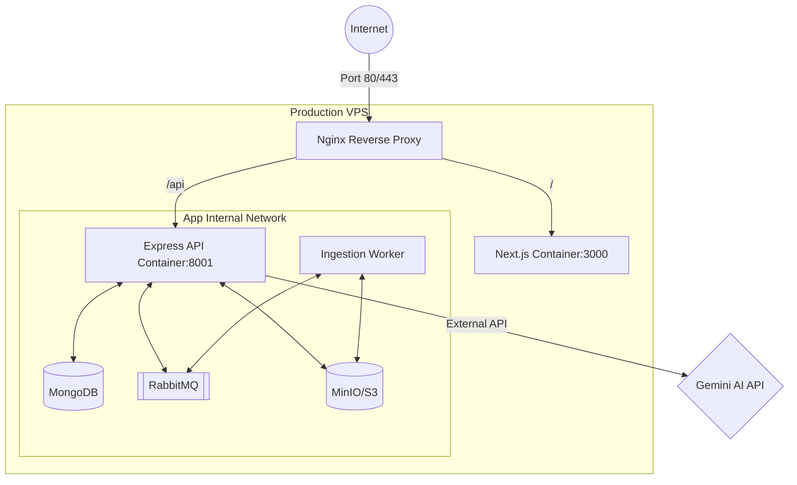

# Deployment Guide — CogniCV

This document provides a comprehensive guide for deploying the CogniCV platform on a Virtual Private Server (VPS) using Docker, Docker Compose, and Nginx as a reverse proxy.

---

## 🏗 Deployment Architecture

The following diagram illustrates how the components interact on the production VPS. Nginx acts as the entry point, routing traffic to the appropriate Docker containers.



---

## 🛠 Prerequisites

- **VPS**: A Linux server (Ubuntu 22.04+ recommended) with at least 4GB RAM.
- **Domain Name**: Pointed to your VPS IP address (e.g., `app.cognicv.com`).
- **Software**: Docker and Docker Compose installed on the VPS.
- **API Keys**: A valid Google Gemini API Key.

---

## 📦 Step 1: Prepare the Server

1.  **Clone the Repository**:
    ```bash
    git clone <your-repo-url> /var/www/cognicv
    cd /var/www/cognicv
    ```

2.  **Setup Environment Variables**:
    Create `.env` files for both the client and server based on the `.env.example` files. Ensure `NODE_ENV` is set to `production`.

---

## 🐳 Step 2: Docker Orchestration

You should create a `docker-compose.prod.yml` that includes your application containers.

### Example Production Services
```yaml
services:
  # Infrastructure
  mongodb:
    image: mongo:latest
    volumes: [mongo_data:/data/db]
  
  rabbitmq:
    image: rabbitmq:4-management
  
  minio:
    image: minio/minio
    command: server /data

  # Application
  server:
    build: ./server
    environment:
      - NODE_ENV=production
    depends_on: [mongodb, rabbitmq, minio]

  client:
    build: ./client
    environment:
      - NODE_ENV=production
      - NEXT_PUBLIC_SERVER_URL=https://app.cognicv.com/api
```

---

## 🌐 Step 3: Nginx Configuration

Install Nginx on your VPS and create a configuration block in `/etc/nginx/sites-available/cognicv`.

```nginx
server {
    listen 80;
    server_name app.cognicv.com;

    # Frontend - Next.js
    location / {
        proxy_pass http://localhost:3000;
        proxy_http_version 1.1;
        proxy_set_header Upgrade $http_upgrade;
        proxy_set_header Connection 'upgrade';
        proxy_set_header Host $host;
        proxy_cache_bypass $http_upgrade;
    }

    # Backend - Express API
    location /api/ {
        rewrite ^/api/(.*)$ /$1 break; # Strip /api prefix
        proxy_pass http://localhost:8001;
        proxy_http_version 1.1;
        proxy_set_header Host $host;
        proxy_set_header X-Real-IP $remote_addr;
        proxy_set_header X-Forwarded-For $proxy_add_x_forwarded_for;
    }

    # Security: Increase client_max_body_size for large PDF uploads
    client_max_body_size 20M;
}
```

Enable the site and reload Nginx:
```bash
sudo ln -s /etc/nginx/sites-available/cognicv /etc/nginx/sites-enabled/
sudo nginx -t
sudo systemctl reload nginx
```

---

## 🔒 Step 4: SSL Termination (HTTPS)

Use Certbot to automatically obtain and configure a Let's Encrypt SSL certificate:

```bash
sudo apt install certbot python3-certbot-nginx
sudo certbot --nginx -d app.cognicv.com
```

---

## 🚀 Step 5: Launch

1.  **Build and Start Containers**:
    ```bash
    docker-compose -f docker-compose.prod.yml up -d --build
    ```

2.  **Verify Deployment**:
    - Visit `https://app.cognicv.com` to see the dashboard.
    - Check API health at `https://app.cognicv.com/api/health` (or your health check endpoint).

---

## 📝 Maintenance & Logs

- **View Application Logs**: `docker-compose logs -f server`
- **Restart Services**: `docker-compose restart client server`
- **Update Application**:
  ```bash
  git pull
  docker-compose -f docker-compose.prod.yml up -d --build
  ```

---

© 2026 CogniCV Team. Built for the Umurava AI Hackathon.
