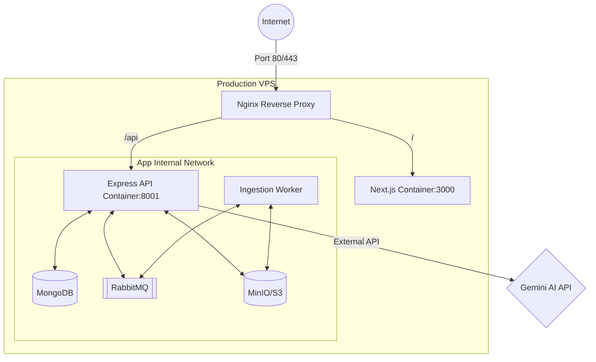

# Deployment Guide — CogniCV

This document provides a comprehensive guide for deploying the CogniCV platform on a Virtual Private Server (VPS) using Docker, Docker Compose, and Nginx as a reverse proxy.

## Deployment Architecture

The following diagram illustrates how the components interact on the production VPS. Nginx acts as the entry point, routing traffic to the appropriate Docker containers.



## Prerequisites

- **VPS**: A Linux server (Ubuntu 22.04+ recommended) with at least 4GB RAM.
- **Domain Name**: Pointed to your VPS IP address (e.g., `cognicv.101software.site`).
- **Software**: Docker and Docker Compose installed on the VPS.
- **API Keys**: A valid Google Gemini API Key.

---

## Step 1: Prepare the Server

1.  **Clone the Repository**:
    ```bash
    git clone <your-repo-url> /var/www/cognicv
    cd /var/www/cognicv
    ```

2.  **Setup Environment Variables**:
    Create `.env` files for both the client and server based on the `.env.example` files. Ensure `NODE_ENV` is set to `production`.

---

## Step 2: Docker Orchestration

You should setup docker with the provided compose file

## Step 3: Nginx Configuration

Install Nginx on your VPS and create a configuration block in `/etc/nginx/sites-available/cognicv` and configure nginx for your site.

## Step 4: SSL Termination (HTTPS)

Use Certbot to automatically obtain and configure a Let's Encrypt SSL certificate:

## Step 5: Launch

1.  **Build and Start Containers**:
    ```bash
    docker-compose -f docker-compose.prod.yml up -d --build
    ```
    - you can always refer to the README.md for detailed instructions.


## Maintenance & Logs

- **View Application Logs**: `docker-compose logs -f server`
- **Restart Services**: `docker-compose restart client server`


© 2026 CogniCV Team. Built for the Umurava AI Hackathon.
